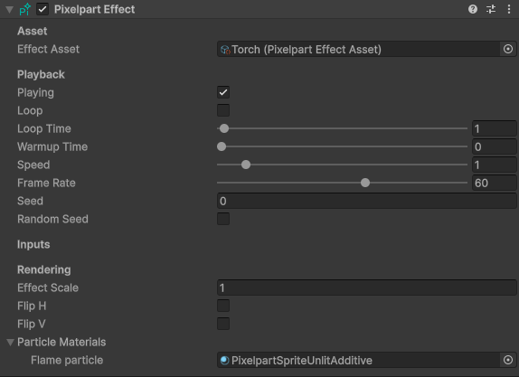
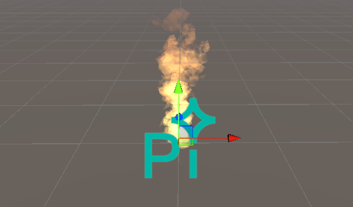

# Pixelpart for Unity

This repository contains the official Pixelpart plugin for Unity 2021.3+. The plugin allows you to play Pixelpart effects directly within the Unity engine.

## Installation

You can install the plugin package from OpenUPM or by downloading it from the Pixelpart website and installing it manually. The plugin comes with prebuilt binaries for the supported platforms (see below).

### OpenUPM

The plugin is available on OpenUPM as the package *net.pixelpart.core*. See [openupm.com](https://openupm.com/docs/getting-started.html) for instructions on how to install packages from OpenUPM. Projects that use the Universal Rendering Pipeline (URP) or the High-Definition Rendering Pipeline (HDRP) additionally require the packages *net.pixelpart.urp* and *net.pixelpart.hdrp*, respectively.

### Manual Install

You can also manually install the plugin by downloading it from [pixelpart.net](https://pixelpart.net/plugins/). Once you've opened the project where you want to use Pixelpart, install the core package *net.pixelpart.core.tgz* using the Unity Package Manager. If your project utilizes the Universal Rendering Pipeline (URP) or the High-Definition Rendering Pipeline (HDRP), make sure to also install *net.pixelpart.urp.tgz* for URP or *net.pixelpart.hdrp.tgz* for HDRP.

## Usage

Here are the basic steps to display a Pixelpart effect in Unity. A detailed user guide can be found on [pixelpart.net](https://pixelpart.net/documentation/unity/).

1. Put the *.ppfx* file created with Pixelpart into the *Assets* folder of your Unity project. Unity recognizes the *.ppfx* file as a Pixelpart effect and shows it with the Pixelpart icon in the project browser if the plugin is installed.

2. Attach the *Pixelpart/Pixelpart Effect* component to a game object in your scene.

3. Drag the effect asset (the *.ppfx* file) onto the *Effect Asset* field in the component's inspector. The effect should play automatically when you select the game object.

## Supported Platforms

The plugin can be used on the following platforms:

- Windows
- Linux
- macOS
- iOS
- Android
- Web
