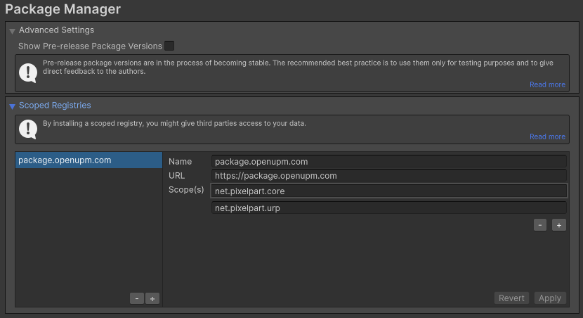

# Installation

The recommended way to install the plugin is from OpenUPM, but it can also be installed manually.

## OpenUPM

1. In Unity, open *Edit/Project Settings/Package Manager* and add OpenUPM as a Scoped Registry. See [openupm.com](https://openupm.com/docs/getting-started.html) for further information.

2. In the Unity Package Manager, click `+`, then `Install package by name...`.
3. Put *net.pixelpart.core* into the *Name* field and the exact required version of the plugin (e.g. *1.8.1*) into the *Version* field. Then, click `Install`.
4. If the project uses the Universal Rendering Pipeline (URP), additionally install the package *net.pixelpart.urp* in the same way. Make sure to add *net.pixelpart.urp* as a *Scope* in the Package Manager settings beforehand.
5. If the project uses the High-Definition Rendering Pipeline (HDRP), additionally install the package *net.pixelpart.hdrp* in the same way. Make sure to add *net.pixelpart.hdrp* as a *Scope* in the Package Manager settings beforehand.

## Manual Install

1. Download the plugin from the Pixelpart website and extract the archive.
2. Start the Unity editor and open the project where you want to use Pixelpart.
3. Install the base plugin package *net.pixelpart.core.tgz* with the Unity Package Manager. See [docs.unity3d.com](https://docs.unity3d.com/Manual/upm-ui-tarball.html) for more details.
4. If the project uses the Universal Rendering Pipeline (URP), additionally install the package *net.pixelpart.urp.tgz*.
5. If the project uses the High-Definition Rendering Pipeline (HDRP), additionally install the package *net.pixelpart.hdrp.tgz*.

## Requirements

Unity 2021.3 or higher is required to use the Pixelpart plugin.

## Platform Support

The plugin supports the following platforms:

Platform | Architectures | Supported
-------- | ------------- | ---------
Windows | x64, x86_32 | Yes
Linux | x64, x86_32 | Yes
macOS | Universal | Yes
iOS | arm64 | Yes
Android | arm64, arm32, x64, x86_32 | Yes
Web | wasm32 | Yes
Console | | No
